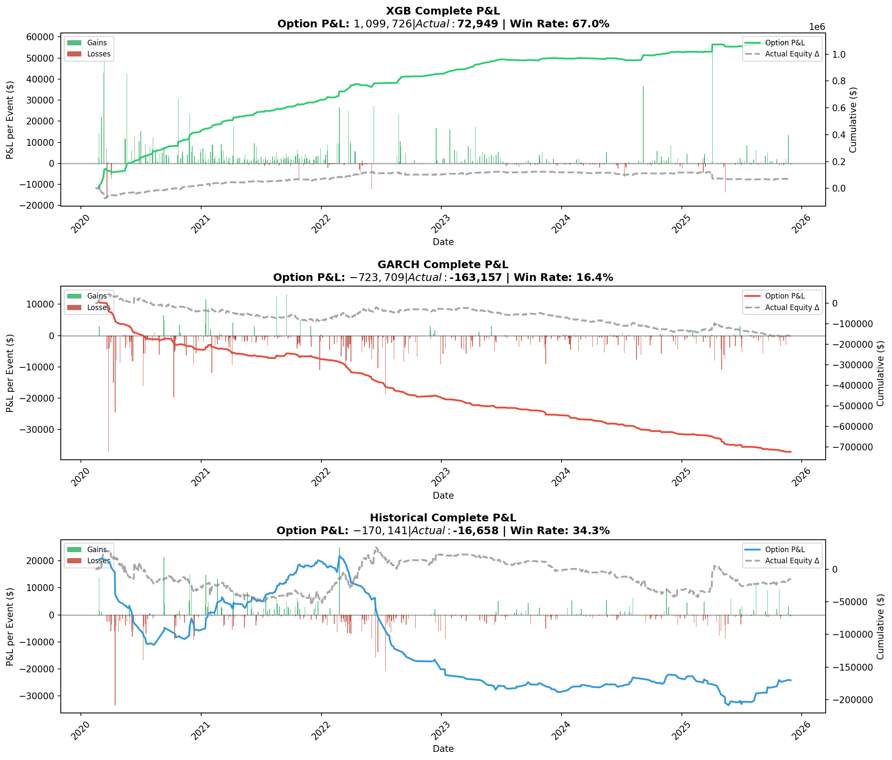
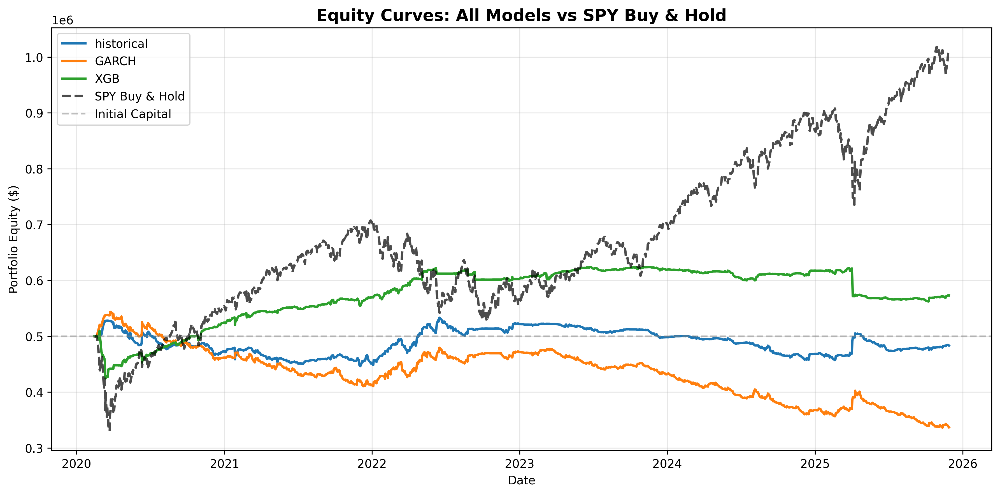

# Volatility Forecasting for Delta-Neutral Options Trading

> **A quantitative research project comparing volatility forecasting methods (Historical Rolling, GARCH, XGBoost) and their impact on risk-adjusted returns in a delta-neutral options trading strategy on SPY.**

---

## Table of Contents

1. [Executive Summary](#executive-summary)
2. [Research Questions](#research-questions)
3. [Project Pipeline](#project-pipeline)
4. [Data Sources](#data-sources)
5. [Volatility Forecasting Models](#volatility-forecasting-models)
6. [Trading Strategy](#trading-strategy)
7. [Results](#results)
8. [Key Findings & Insights](#key-findings--insights)
9. [Statistical Significance Analysis](#statistical-significance-analysis)
10. [Project Structure](#project-structure)
11. [Future Research Directions](#future-research-directions)
12. [How to Run](#how-to-run)

---

## Executive Summary

This project implements a complete backtesting framework to evaluate different volatility forecasting methods through a delta-neutral SPY options trading strategy. The core hypothesis is that more sophisticated volatility models (GARCH, Machine Learning) should identify option mispricings more accurately than naive historical volatility, leading to better risk-adjusted returns.

**Why Delta-Neutral?** The strategy employs delta hedging to isolate volatility exposure from directional market movements. This design choice ensures that performance differences between models stem from volatility forecasting accuracy rather than directional market exposure. However, while this approach eliminates directional bias, the hedge P&L significantly impacts overall returns, particularly in strongly trending markets.

**Key Findings**: 
- While XGBoost significantly outperformed GARCH in volatility forecasting accuracy, there was **no statistically significant difference** when comparing either model to a naive historical estimate
- The delta-neutral trading strategy **did not produce a meaningful risk-adjusted return** regardless of the volatility forecasting method used
- When examining options-only P&L (excluding hedge positions), **XGBoost generated over $1M in option profits**—demonstrating superior mispricing detection that was subsequently eroded by hedging costs in a trending market
- Delta hedging can completely erode gains from a successful options strategy, while also providing a safety net for poorly performing ones

### Performance Summary (Jan 2020 - Nov 2025)

| Model | Total Return | Ann. Return | Sharpe Ratio | Max Drawdown | Win Rate |
|-------|-------------|-------------|--------------|--------------|----------|
| **XGB** | +14.59% | +2.39% | -0.03 | -16.74% | 61.1% |
| Historical | -3.33% | -0.58% | -0.48 | -15.46% | 32.1% |
| GARCH | -32.63% | -6.61% | -1.24 | -38.12% | 14.3% |

---

## Research Questions

#### 1. Which volatility estimation method produces the best risk-adjusted returns when trading options with delta-neutral hedging?

#### 2. Is statistical forecasting accuracy predictive of trading performance?

#### 3. Are sophisticated volatility forecasting models significantly better than simple and naive alternatives?

---

## Project Pipeline

```
┌─────────────────────────────────────────────────────────────────────────────┐
│                           DATA SPLIT TIMELINE                               │
├─────────────────────────────────────────────────────────────────────────────┤
│  1993 ──────────── 2015 ──────────── 2020 ──────────── 2025                 │
│    │                 │                 │                 │                  │
│    └─── TRAINING ────┘                 │                 │                  │
│         (Vol Models)                   │                 │                  │
│                      │                 │                 │                  │
│                      └─── TESTING ─────┘                 │                  │
│                           (Accuracy)                     │                  │
│                                        │                 │                  │
│                                        └─── BACKTEST ────┘                  │
│                                             (Trading)                       │
└─────────────────────────────────────────────────────────────────────────────┘
```

### Phase 1: Volatility Model Development (1993-2014 Training)

1. **Data Preprocessing**: Load SPY prices (OHLCV), VIX data, and calculate log returns
   - VIX regimes are defined using historical thresholds to compute regime-conditional VRP for use in the backtest
2. **Feature Engineering** for XGBoost:
   - Lagged VIX (yesterday's close)
   - Realized volatility at multiple horizons (1d, 5d, 22d, 30d, 60d, 120d)
   - Leverage effect features (cumulative returns)
   - Asymmetric volatility (negative semivariance)
3. **Model Training**:
   - XGBoost: RandomizedSearchCV with TimeSeriesSplit (5-fold), optimized on Spearman correlation
   - GARCH: Rolling 30-day window, fit daily during backtest
   - Historical: Simple 30-day rolling standard deviation
- Note: GARCH and Naive historical estimate do not require a training period.

### Phase 2: Model Testing (2015-2019)

- Out-of-sample forecasting accuracy evaluation
- Diebold-Mariano statistical significance tests, QLIKE loss comparison
- Regime-conditional performance analysis
- Note: Model testing is only concerned with realized volatility forecasting accuracy

### Phase 3: Strategy Backtesting (2020-2025)

The backtest applies each volatility model to a delta-neutral options trading strategy with the following characteristics:

**Strategy Overview**:
- **Objective**: Identify and trade mispriced options based on volatility forecasts
- **Option Universe**: SPY options with 30 days to expiration (DTE), strikes within ±5% of spot
- **Pricing Model**: Black-Scholes with model-forecasted implied volatility
- **Position Sizing**: Maximum 21 positions (1 position for the underlying hedge), 2 contracts per trade, 1x leverage limit
- **Risk Controls**: 40% max short exposure, 50% max single position size

**Key Assumptions**:
- Options are priced at mid-price (average of bid/ask)
- Transaction costs: $0.50 per option contract, 5 bps for stock trades
- Daily mark-to-market and hedge rebalancing

```
┌────────────────────────────────────────────────────────────────────────┐
│                         DAILY BACKTEST LOOP                            │
├────────────────────────────────────────────────────────────────────────┤
│  For each trading day:                                                 │
│    1. Forecast realized volatility (RV) using vol model                │
│    2. Add Variance Risk Premium (VRP) based on regime → IV forecast    │
│    3. Price all options using Black-Scholes with forecasted IV         │
│    4. Identify mispricings:                                            │
│       • BUY if market price < 50% of theoretical (underpriced)         │
│       • SELL if market price > 80% above theoretical (overpriced)      │
│    5. Execute option trades with delta hedge (stock position)          │
│    6. Rebalance delta hedges daily                                     │
│    7. Handle expirations and early exits (if mispricing resolves)      │
│    8. Mark-to-market and log P&L                                       │
└────────────────────────────────────────────────────────────────────────┘
```

---

## Data Sources

| Data | Source | Period | Format |
|------|--------|--------|--------|
| **Options** | ThetaData | 2020-2025 | EOD snapshots, monthly parquet files |
| **SPY Prices** | yfinance | 1993-2025 | Daily OHLCV |
| **VIX** | yfinance | 1993-2025 | Daily closes |
| **Risk-Free Rate** | yfinance | 1993-2025 | 13-week T-bill |

### Data Structure

```
data/
├── processed/
│   ├── spy_prices.parquet          # Daily SPY OHLCV
│   ├── vix_data.parquet            # Daily VIX closes
│   ├── risk_free_rate.parquet      # 13-week T-bill rates
│   └── spy_options_YYYY_MM.parquet # Monthly option snapshots (2020-2025)
└── raw/
    └── ...                          # Raw data before preprocessing
```

---

## Volatility Forecasting Models

### 1. Historical Rolling Volatility (Naive Baseline)

**Implementation**: `src/volatility/historical.py` → `RollingVolCalculator`

The simplest approach—30-day trailing standard deviation of log returns (lagged), annualized.

```
σ_t = std(r_{t-29}, r_{t-28}, ..., r_t) × √252
```

**Strengths**: No look-ahead bias, computationally trivial, no training required  
**Weaknesses**: Backward-looking, slow to react to regime changes

### 2. GARCH(1,1)

**Implementation**: `src/volatility/forecasting.py` → `GARCHForecaster`

Classic econometric model capturing volatility clustering and mean-reversion.

```
σ²_t = ω + α·r²_{t-1} + β·σ²_{t-1}

Where:
  ω = long-run variance level
  α = reaction to recent shocks (ARCH term)
  β = persistence of variance (GARCH term)
```

**Multi-step forecast**: Uses unconditional variance as attractor with persistence decay:
```
E[σ²_{t+h}] = σ²_∞ + (α+β)^h × (σ²_t - σ²_∞)
```

**Strengths**: Captures volatility clustering, industry standard, interpretable  
**Weaknesses**: Symmetric response to positive/negative shocks (leverage effect), refitting is slow

### 3. XGBoost Machine Learning

**Implementation**: `src/volatility/forecasting.py` → `MLForecaster`

Gradient boosting model trained on engineered features capturing volatility dynamics.

**Features (14 total)**:
| Category | Features |
|----------|----------|
| **VIX** | Yesterday's VIX close |
| **Realized Vol** | 1d, 5d, 22d, 30d, 60d, 120d rolling volatility |
| **Leverage Effect** | 1d, 22d, 30d, 60d, 120d cumulative returns |
| **Asymmetric Vol** | 5-day negative semivariance |
| **Horizon** | Forecast horizon (30 days) |

**Training Configuration**:
- Objective: Custom asymmetric squared error (penalizes underprediction 1.5x)
- CV: TimeSeriesSplit with 5 folds
- Optimization: Spearman correlation (rank-based accuracy)
- Best params: `n_estimators=300, max_depth=3, learning_rate=0.01`

**Strengths**: Captures non-linear relationships, leverage effect, regime interactions  
**Weaknesses**: Difficult to interpret, potential to overfitting

---

## Trading Strategy

### Variance Risk Premium (VRP) Adjustment

**Implementation**: `src/volatility/vrp.py`

Before pricing options, realized volatility forecasts are converted to implied volatility estimates by adding the Variance Risk Premium.

```
IV_estimate = RV_forecast + VRP_adjustment
```

**VRP Estimation**:
- Historical VRP = VIX(t) - RV(t → t+30)
- Regime-conditional: Different VRP by VIX level

VRP is estimated on historical data (1993-2014) and applied based on the current VIX regime:

| Regime | VIX Level | Mean VRP |
|--------|-----------|----------|
| Low | < 15 | 2.37% |
| Normal | 15-25 | 3.32% |
| High | ≥ 25 | 6.08% |

### Mispricing Detection

**Implementation**: `src/backtest/strategy.py` → `MispricingStrategy`

```
Mispricing % = (Market Price - Theoretical Price) / Theoretical Price
```

**Trade Signals**:
- **BUY** if market price < -50% of theoretical price 
- **SELL** if market price > +80% of theoretical

*Asymmetric thresholds*: Selling has unlimited risk, so requires larger mispricing to compensate.

### Delta Hedging

Every option position is immediately delta-hedged with stock:

```
Hedge shares = -Option contracts × Delta × 100
```

**Daily Rebalancing**: Delta changes as underlying moves and time passes. Hedges are rebalanced daily to maintain delta neutrality, ensuring the strategy profits from volatility (vega) not direction.

### Position Management

| Parameter | Value | Rationale |
|-----------|-------|-----------|
| Max positions | 21 | Diversification across strikes/expiries |
| Contracts per trade | 2 | Position sizing with capital constraints |
| Max leverage | 1.0x | Conservative—no margin borrowing |
| Max short exposure | 40% | Limit tail risk from short options |
| Early exit threshold | ±25% | Close if mispricing converges to fair value |

---

## Results

### Complete P&L

XGBoost-based strategy saw substantial options P&L upside, heavily suppressed by hedging costs (results of which can be seen in the equity curves).



### Equity Curves



### P&L Decomposition

Based on $500,000 initial capital:

| Strategy | Total Return | Net P&L |
|----------|-------------|---------|
| **XGB** | +14.59% | **+$72,949** |
| Historical | -3.33% | **-$16,658** |
| GARCH | -32.63% | **-$163,157** |

**Critical Observation**: The `results_exploration.ipynb` notebook reveals that XGBoost generated substantial *option-only* P&L, but delta hedging in a trending market destroyed significant gains.

#### Complete P&L Reconciliation

| Strategy | Expiry P&L | Early Exit P&L | Total Option P&L | Hedge + Costs | Actual Equity Δ |
|----------|------------|----------------|------------------|---------------|-----------------|
| **XGB** | +$840,754 | +$258,972 | **+$1,099,726** | -$1,026,776 | +$72,949 |
| Historical | +$14,144 | -$184,285 | -$170,141 | +$153,483 | -$16,658 |
| GARCH | -$376,362 | -$347,348 | -$723,709 | +$560,553 | -$163,157 |

**Interpretation**: XGBoost's option-only P&L of +$1.1M was almost entirely offset by hedge losses (-$1.03M). Conversely, GARCH's poor option performance (-$724K) was partially cushioned by hedge gains (+$561K). This demonstrates how delta hedging acts as a stabilizer—dampening both gains and losses.

### Trade Distribution

| Strategy | Total Trades | Puts | Calls | Buys | Sells |
|----------|-------------|------|-------|------|-------|
| XGB | 1,682 | 63% | 37% | 40% | 60% |
| GARCH | 1,919 | 10% | 90% | 75% | 25% |
| Historical | 1,634 | 24% | 76% | 65% | 35% |

**Key Patterns**:
- XGB was more balanced but biased toward selling options (60% sells)—primarily puts, which works well in rising markets but carries tail risk
- GARCH and Historical were predominantly buying calls, essentially paying for upside exposure that often expired worthless
- XGB's selling bias captures variance risk premium more effectively
- Put-centric trades generally outperformed call-centric trades across all models

---

## Key Findings & Insights

### 1. Which volatility estimation method produces the best risk-adjusted returns when trading options with delta-neutral hedging?

**XGBoost's volatility forecast was the most successful** in finding truly mispriced options. However, delta hedging in a strongly trending market (SPY +70% from 2020-2024) eroded nearly all option profits. The model was most successful during 2020-2023 (excluding the COVID crash), after which alpha appeared to decay.

Delta hedging is theoretically necessary for isolating volatility exposure, but in practice:
- **In trending markets**: Continuous hedging means constantly shorting a rising asset
- **Rebalancing costs compound**: Daily adjustments add friction
- **Gamma scalping requires RV > IV**: But VRP means IV typically exceeds RV

GARCH and naive historical were unable to consistently find truly mispriced options. In these cases, delta hedging actually cushioned losses from both underperforming strategies.

### 2. Is statistical forecasting accuracy predictive of trading performance?

XGBoost demonstrated statistically significant superiority over GARCH (p=0.0043 on QLIKE loss) and marginally outperformed Historical (5% RMSE reduction). Yet overall trading performance was modest due to hedging costs.

**The key insight**: Forecasting accuracy *does* translate to better option selection, as evidenced by XGBoost's +$1.1M option-only P&L. However, the path from accurate forecasts to profitable trading is mediated by strategy design, particularly hedging methodology.

#### Regime-Conditional Performance

| Regime | XGB Sharpe | GARCH Sharpe | Historical Sharpe |
|--------|------------|--------------|-------------------|
| Low (VIX < 15) | -3.38 | -7.20 | -3.68 |
| Normal (15-25) | **3.77** | -1.76 | -0.54 |
| High (VIX > 25) | -1.02 | 1.91 | 1.03 |

| Regime | XGB Win Rate | GARCH Win Rate | Historical Win Rate |
|--------|--------------|----------------|---------------------|
| Low (VIX < 15) | 33.6% | 22.4% | 41.2% |
| Normal (15-25) | **61.2%** | 38.1% | 44.0% |
| High (VIX > 25) | 43.7% | 49.7% | 47.0% |

**Observations**:
- XGBoost excelled in normal volatility regimes (Sharpe of 3.77, 61% win rate)
- All models struggled in low-VIX environments
- High-VIX regimes favored simpler models, possibly due to XGBoost overfitting to calmer historical patterns

### 3. Are sophisticated volatility forecasting models significantly better than simple and naive alternatives?

**Statistically**: XGBoost significantly outperforms GARCH (p=0.004), but neither model significantly beats naive historical volatility in forecasting accuracy.

| Test | Result |
|------|--------|
| XGB vs GARCH (Diebold-Mariano) | **Significant (p=0.004)** |
| XGB vs Historical | Not significant (p=0.26) |
| GARCH vs Historical | Not significant (p=0.54) |

**Economically**: Despite lacking statistical significance in forecasting, XGBoost demonstrated clear economic value:
- **6x higher win rate** than GARCH (61% vs 14%)
- **$1.8M better option P&L** than GARCH (+$1.1M vs -$724K)
- Only positive total return among all strategies

This underscores that **statistical significance is not sufficient for trading profitability**—strategy design, transaction costs, and execution quality matter equally. Conversely, a model without statistically significant forecasting improvement can still add substantial economic value through better option selection and timing.

---

## Statistical Significance Analysis

### Forecasting Accuracy (Test Period: 2015-2019)

| Metric | Historical | GARCH | XGBoost |
|--------|------------|-------|---------|
| RMSE | 5.02 | 6.07 | **4.79** |
| MAE | **3.89** | 5.24 | 4.15 |
| Correlation | **0.62** | 0.10 | 0.60 |
| Spearman | **0.65** | 0.04 | 0.62 |
| QLIKE Loss | 0.146 | 0.170 | **0.116** |

### Diebold-Mariano Test Results

Using QLIKE loss (appropriate for volatility forecasting):

```
H0: No difference in predictive accuracy
H1: Model 1 has different accuracy than Model 2

XGBoost vs Naive:    DM = -1.13,  p = 0.257  (No significant difference)
GARCH vs Naive:      DM = +0.62,  p = 0.538  (No significant difference)
XGBoost vs GARCH:    DM = -2.85,  p = 0.004  (XGBoost significantly better) ✓
```

**Interpretation**: XGBoost's outperformance over GARCH is robust (>99% confidence), but neither sophisticated model significantly differs from istorical volatility at forecasting accuracy.

### Regime-Conditional Forecasting Performance

| Regime | XGB RMSE | GARCH RMSE | Historical RMSE |
|--------|----------|------------|-----------------|
| Low (<12%) | 2.08 | 3.47 | 2.15 |
| Normal (12-25%) | 4.24 | 5.27 | 4.33 |
| Stress (>25%) | 9.54 | 11.37 | 10.07 |

All models struggle during high-volatility regimes, but XGBoost shows more consistent performance across conditions.

---

## Project Structure

```
options-trading/
├── README.md                          # This file
├── data/
│   ├── processed/                     # Cleaned parquet files
│   └── raw/                           # Original data downloads
├── notebooks/
│   ├── xgboost_development.ipynb      # ML model training & validation
│   ├── results_exploration.ipynb      # Post-backtest analysis
│   └── scratch_paper.ipynb            # Exploratory analysis
├── results/
│   ├── backtest_analysis/             # Generated analysis plots
│   ├── early_exit_logs/               # Early exit trade details
│   ├── equity_logs/                   # Daily equity by strategy
│   ├── expiry_logs/                   # Option expiration details
│   ├── IV_logs/                       # Daily IV predictions
│   ├── plots/                         # Equity curves, IV comparison
│   ├── trade_logs/                    # Complete trade records
│   └── final_metrics.csv              # Summary performance metrics
├── src/
│   ├── backtest/
│   │   ├── engine.py                  # Core backtest loop, portfolio management
│   │   ├── main.py                    # Configuration & orchestration
│   │   └── strategy.py                # Signal generation, mispricing detection
│   ├── pricing/
│   │   ├── pricer.py                  # Black-Scholes option pricing
│   │   └── greeks.py                  # Delta, gamma, vega, theta, rho, IV solver
│   ├── preprocess/                    # Data cleaning scripts
│   └── volatility/
│       ├── forecasting.py             # GARCH & XGBoost models
│       ├── historical.py              # Rolling volatility calculator
│       └── vrp.py                     # Variance Risk Premium estimation
├── tests/                             # Unit tests
└── validations/                       # Model validation scripts
```

### Key Module Descriptions

| Module | Purpose |
|--------|---------|
| `src/backtest/engine.py` | Core backtest loop, portfolio management, position tracking, delta rebalancing, P&L calculation |
| `src/backtest/strategy.py` | Vectorized Black-Scholes pricing, mispricing detection, signal generation, early exit logic |
| `src/backtest/main.py` | Configuration parameters, backtest orchestration, metrics calculation, visualization |
| `src/volatility/forecasting.py` | GARCH(1,1) and XGBoost volatility forecasters with pre-training support |
| `src/volatility/vrp.py` | Variance Risk Premium calculator with regime-conditional estimation |
| `src/pricing/greeks.py` | All Greeks (delta, gamma, vega, theta, rho) + Newton-Raphson IV solver |

---

## Future Research Directions

### 1. Alternative Hedging Strategies
The most impactful improvement would be revisiting the hedging methodology:
- **Discrete rebalancing**: Weekly vs. daily hedging to reduce transaction costs
- **Delta bands**: Only rebalance when delta exposure exceeds a threshold (e.g., ±0.05)
- **Gamma scalping optimization**: Hedge less frequently in low-gamma regimes

### 2. Ensemble Volatility Models
Combine the strengths of multiple approaches:
- Weighted ensemble of GARCH, XGBoost, and implied vol
- Regime-switching model that selects the best forecaster per market condition
- Attention-based neural networks (transformers) for sequence modeling

### 3. Expanded Trading Strategies
Test whether forecasting improvements translate better to alternative structures:
- **Straddle/strangle trading**: Pure volatility plays without delta hedging
- **Calendar spreads**: Exploit term structure mispricings using multi-horizon forecasts
- **Volatility arbitrage**: Long realized vol, short implied vol via variance swaps

---

## How to Run

### Prerequisites

```bash
# Python 3.9+
pip install -r requirements.txt
```

Key dependencies:
- `pandas`, `numpy` for data manipulation
- `xgboost` for ML model
- `arch` for GARCH modeling
- `scipy` for statistical tests and optimization
- `matplotlib`, `plotly` for visualization

Note: Options data requires ThetaData subscription.

### Run Full Backtest

```bash
cd src/backtest
python main.py
```

This will:
1. Load all data (options, prices, VIX, rates)
2. Initialize VRP calculator
3. Run backtests for all three volatility models
4. Generate performance metrics and visualizations
5. Save results to `results/` directory

### Explore Results

Open `notebooks/results_exploration.ipynb` to:
- Analyze P&L decomposition
- View trade distribution by option type
- Generate regime-conditional performance metrics
- Create visualizations for reporting

### Train/Evaluate XGBoost Model

Open `notebooks/xgboost_development.ipynb` to:
- Perform hyperparameter tuning
- Evaluate forecasting accuracy
- Run statistical significance tests
- Analyze feature importance

---
